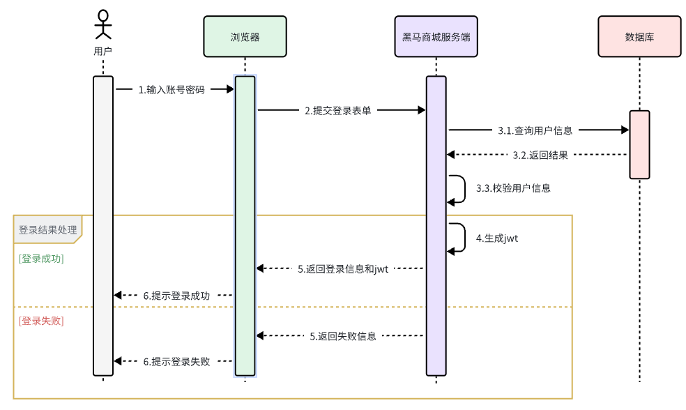
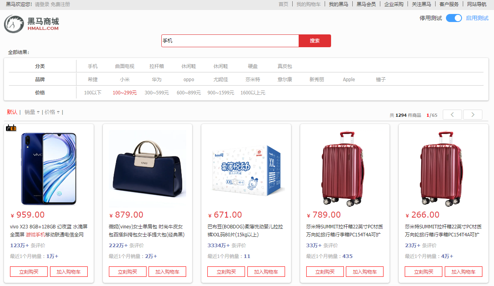
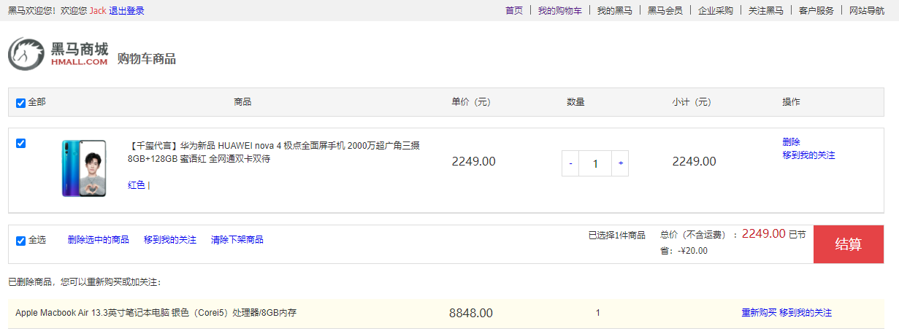
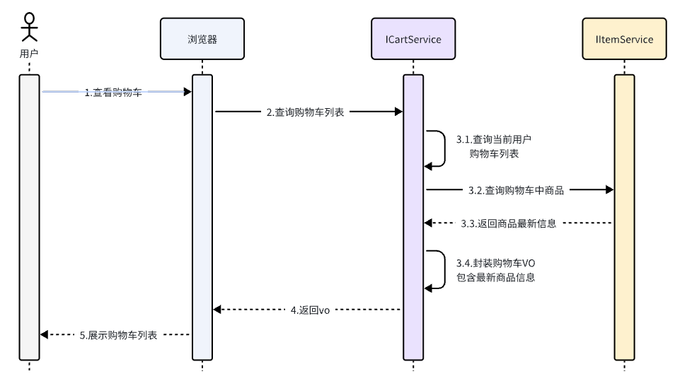
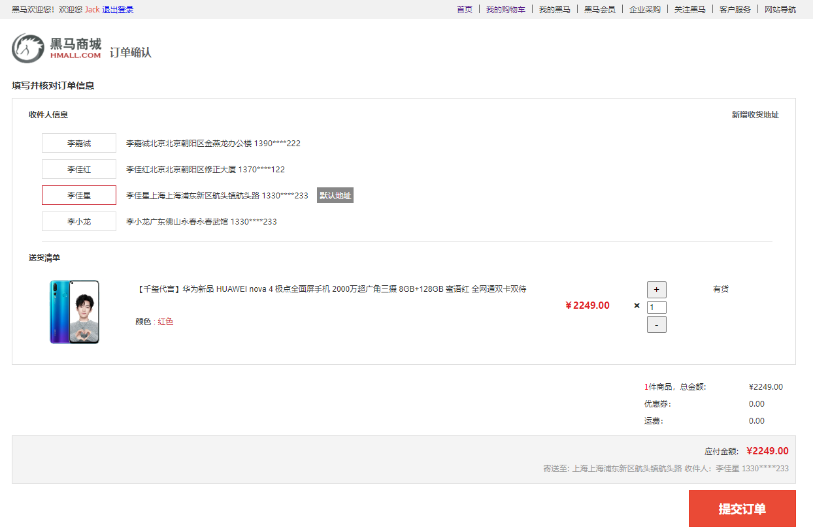
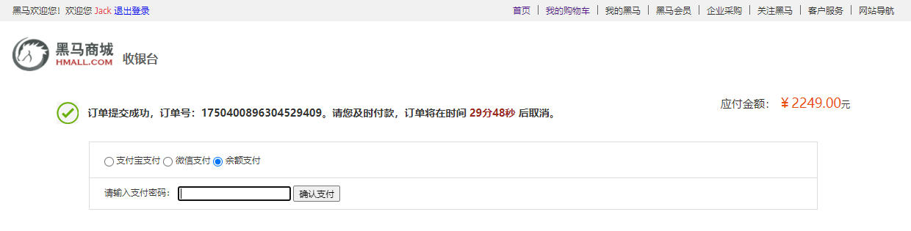

分布式黑马商城
reference：https://b11et3un53m.feishu.cn/wiki/NNAtw4CFQijiYakX8tgczWvWn0b
# 技术背景
- springboot
- feign
- gateway
- nacos
- sentinel
- seata

# 环境
- java11
- mysql 8.0.27
- springboot 2.7.12
- spring-cloud 2021.0.3
- spring-cloud-alibaba 2021.0.4.0

# 导入hmall工程

- Windows下启动后端服务
访问http://localhost:8080/hi

- Windows下启动nginx，比Linux还方便，nginx-hmall里面已经打包好了前端工程，并且配置好了nginx.conf
```shell
# 启动nginx
start nginx.exe
# 停止
nginx.exe -s stop
# 重新加载配置
nginx.exe -s reload
# 重启
nginx.exe -s restart
```
访问http://localhost:18080

## 登录业务
登录入口在com.hmall.controller.UserController中的login方法：


## 搜索业务
该页面会调用接口：/search/list，对应的服务端入口在com.hmall.controller.SearchController中的search方法：


## 购物车业务

在搜索到的商品列表中，点击按钮加入购物车，即可将商品加入购物车：

同时这里还可以对购物车实现修改、删除等操作。
相关功能全部在com.hmall.controller.CartController中

其中，查询购物车列表时，由于要判断商品最新的价格和状态，所以还需要查询商品信息，业务流程如下：


## 下单业务
在购物车页面点击结算按钮，会进入订单结算页面：

点击提交订单，会提交请求到服务端，服务端做3件事情：
- 创建一个新的订单
- 扣减商品库存
- 清理购物车中商品
  
业务入口在com.hmall.controller.OrderController中的createOrder方法

## 支付业务
下单完成后会跳转到支付页面，目前只支持余额支付：

在选择余额支付这种方式后，会发起请求到服务端，服务端会立刻创建一个支付流水单，并返回支付流水单号到前端。
当用户输入用户密码，然后点击确认支付时，页面会发送请求到服务端，而服务端会做几件事情：
- 校验用户密码
- 扣减余额
- 修改支付流水状态
- 修改交易订单状态
  
请求入口在com.hmall.controller.PayController中

# 服务拆分
我们在做服务拆分时一般有两种方式：
- 纵向拆分。就是按照项目的功能模块来拆分。例如黑马商城中，就有用户管理功能、订单管理功能、购物车功能、商品管理功能、支付功能等。那么按照功能模块将他们拆分为一个个服务，就属于纵向拆分。这种拆分模式可以尽可能提高服务的内聚性。

- 横向拆分 。就是看各个功能模块之间有没有公共的业务部分，如果有将其抽取出来作为通用服务。这样可以避免重复开发，避免多处修改。
  - 例如用户登录以及下单业务都需要发送消息通知，和记录风控数据。因此消息发送、风控数据记录就是通用的业务功能，可以将他们分别抽取为公共服务：消息中心服务、风控管理服务。
  - 购物车服务和下单业务都需要执行feign远程调用查询商品价格，因此需要将feign远程调用客户端抽取为公共模块

将来的每一个微服务都会有自己的一个database，服务拆分后的sql脚本见sql目录，这为后面的分布式事务做铺垫

- 拆分出item-service并启动，访问swagger接口文档：http://localhost:8081/doc.html
- 拆分出cart-service并启动，访问swagger文档页面：http://localhost:8082/doc.html
  - 引入RestTemplate方式远程服务调用：cart-service远程访问item-service
  - 引入服务注册中心nacos，记得导入nacos的sql脚本，访问http://192.168.18.100:8848/nacos/#/login
  - item-service引入服务注册发现依赖spring-cloud-starter-alibaba-nacos-discovery，注册item-service的多实例副本进行测试，拷贝Application，配置vm options:-Dserver.port=8083避免端口冲突
  - cart-service引入服务注册发现依赖spring-cloud-starter-alibaba-nacos-discovery
  - cart-service引入feign，超级简单的方式远程调用item-service
  - cart-service引入feign连接池，feign-okhttp
- 拆分出hm-api专门创建所有的feignclient
- 拆分出user-service并启动，访问swagger接口文档：http://localhost:8084/doc.html#/home
- 拆分出trade-service并启动，访问swagger接口文档：http://localhost:8085/doc.html
- 拆分出pay-service并启动，访问swagger接口文档：http://localhost:8086/doc.html

# 分布式网关
至此，我们将黑马商城拆分为5个微服务：
- 用户服务
- 商品服务
- 购物车服务
- 交易服务
- 支付服务
- 还有横向拆分的独立模块hm-api，统一存放所有的feign远程调用客户端

服务拆分之后，相信大家在与前端联调的时候发现了两个问题：
1. 由于每个微服务都有不同的地址或端口，入口不同，请求不同数据时要访问不同的入口，需要维护多个入口地址，麻烦
2. 而微服务拆分后，每个微服务都独立部署，每个微服务都需要编写登录校验、用户信息获取的功能吗？回顾单体架构时我们只需要完成一次用户登录、身份校验，就可以在所有业务中获取到用户信息，单体架构的用户信息传递方案是springmvc拦截器和ThreadLocal存储
  - 定义用户上下文UserContext，持有ThreadLocal引用
  - 定义springmvc拦截器，将保存在用户上下文中的UserContext的ThreadLocal中
  - 在Controller层获取UserContext的ThreadLocal信息

我们会通过分布式网关技术解决上述问题，新建hm-gateway微服务模块
1. 网关鉴权，解决统一登录校验和用户信息获取的问题。
2. 网关路由转发，解决前端请求入口的问题。  
   还有一点，对于每一个模块比如商品模块item-service，生产环境往往会对这个模块做集群部署，此时==网关还能够在后端进行负载均衡寻址==

新建hm-gateway模块
- 内置predicates解决请求转发问题
- 使用自定义GlobalFilter过滤请求并解析token
- 下游微服务如何获取网关filter中的用户
  - 网关改写请求头，放入userid，转发给下游服务
  - 下游定义springmvc拦截器，接收filter请求

# 服务间如何传递用户信息
虽然每个微服务都引入了hm-common（UserInfoInterceptor+UserContext），但每个微服务都有各自的UserContext为自己所用，不同微服务之间用户信息无法传递。

解决方案：由于微服务获取用户信息是通过Springmvc拦截器在请求头中读取，因此要想实现微服务之间的用户信息传递，就必须在微服务发起调用时把用户信息存入请求头。Feign的本质是restTemplate，也是http，这里要借助Feign中提供的一个拦截器接口：`feign.RequestInterceptor`，实现此接口给restTemplate中放入用户信息"user-info"


# 分布式配置中心

服务拆分为多个微服务之后，各个微服务各自维护配置文件，导致了配置文件重复

解决方案：nacos

Nacos统一配置管理，解决服务拆分两大痛点
- 统一配置文件管理，多个微服务之间无需重复配置某些参数，共享配置
- 配置热更新支持，无需重启服务即可生效，降低运维成本

动态路由配置：我们无法利用上面普通的配置热更新来实现路由更新，因为网关的路由配置全部是在项目启动时由org.springframework.cloud.gateway.route.CompositeRouteDefinitionLocator在项目启动的时候加载，并且一经加载就会缓存到内存中的路由表内（一个Map），不会改变。因此要想实现动态路由配置，我们必须监听Nacos的配置变更，然后手动把最新的路由更新到路由表中。这里有两个难点：
- 如何监听Nacos配置变更？在Nacos官网中给出了手动监听Nacos配置变更的SDK：https://nacos.io/zh-cn/docs/sdk.html
- 如何把路由信息更新到路由表？更新路由要用到`org.springframework.cloud.gateway.route.RouteDefinitionWriter`这个接口

# sentinel服务保护
- sentinel面板安装
- sentinel服务整合
- 请求限流
- 线程隔离
  - OpenFeign整合Sentinel
  - 配置线程隔离数量 ：QPS=每秒处理请求数量*线程隔离数量
  - 编写降级逻辑-等待fallback，提供友好的返回信息
- 服务熔断-快速fallback，极限提高吞吐量

# 分布式事务解决方案seata
提前创建seata-server容器服务，注意要与MySQL和nacos配置在同一网络下

seata-server搭建成功，访问seata-server控制面板：http://192.168.18.100:7099/#/GlobalLockInfo

业务相关的模块均引入seata依赖，seata依赖相当于操作seata的客户端
```xml
  <dependency>
      <groupId>com.alibaba.cloud</groupId>
      <artifactId>spring-cloud-starter-alibaba-seata</artifactId>
  </dependency>
```
- XA二阶段提交
- AT二阶段提交
